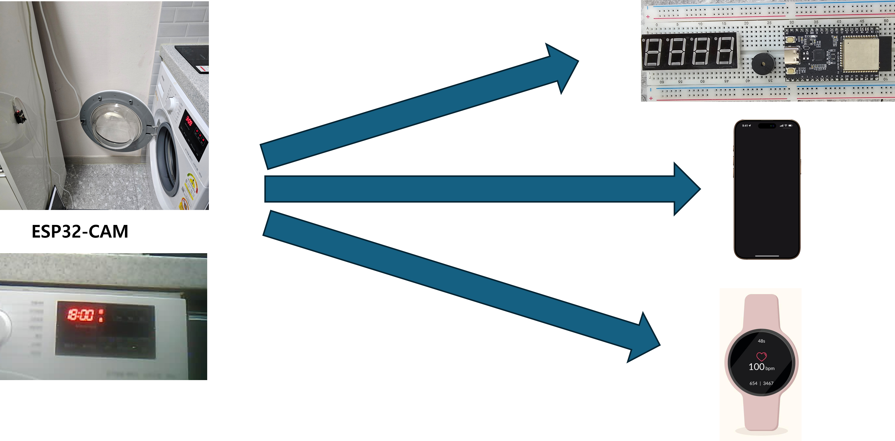

# 세탁기 알림 프로젝트
## 프로젝트 설명
세탁기의 현재 상태를 확인하며, 세탁이 완료되면 여러 디바이스들에게 알림을 보내는 프로젝트입니다.  
세탁기를 돌렸는데 다 완료된 상태로 세탁물을 방치하면 악취가 발생합니다. 해당 경험이 불편하여 세탁이 완료되면 근처에 있는 디바이스를 통해 알림을 받을 수 있으면 좋겠다는 생각으로 프로젝트를 계획하였습니다. 완료알림 뿐만 아니라 세탁완료까지 남은 시간도 확인 할 수 있습니다.

## 구조
  
1. 세탁기에 부착하는 ESP32, 여러 센서들도 같이 부착하여 세탁기의 상태를 확인 후 서버에 전송한다
2. 서버역할을 하는 라즈베리파이4
3. 알림을 받을 클라이언트 ex) 핸드폰, 웹, 다른 ESP32(스피커, OLED연결)
 

### 라즈베리파이4를 서버로 사용한 이유  
  
  구조를 위 사진처럼 할경우 알림을 받을 클라이언트가 늘어날 수록 서버의 부담도 늘어날거라 생각했습니다. 그래서 중간 서버를 두어 ESP32는 해당 서버와만 통신을 함으로서 성능 부담을 줄일 수 있을거라 생각했습니다.   

## 구현 기능

|ESP32 기능|기능 상세 설명|
|--|--|
|세탁기 상태정보 전송|남은 세탁시간, 세탁완료했는지 등의 정보를 서버에 보낸다|
|남은 세탁 시간 확인|세탁기의 LED위치를 카메라로 촬영하여 세탁 시간 및 상태를 추출한다. OCR방식대신 특정 픽셀 위치가 켜져 있는지 여부를 확인한다.세탁기는 7-segment LED를 사용함으로, 세그먼트의 조합을 분석하여 표시된 숫자나 문자를 인식할 수 있다.|
|세탁완료 알람|세탁완료 시 알람을 울리라고 서버에 메시지를 보낸다. 그리고 해당 메시지를 수신한 모든 클라이언트들은 계속 알람이 울린다. ESP32에 연결된 버튼을 누르면 서버에 알람중지 메시지를 보낸다.|

|라즈베리파이 기능|기능 상세 설명|
|--|--|
|ESP32->Client 메시지전달|ESP32의 메시지를 Client가 해석할 수 있는 프로토콜로 변환하여 전송한다|
|Client->ESP32 메시지전달|Client의 메시지를 ESP32가 해석할 수 있는 프로토콜로 변환하여 전송한다|
|로그 저장 및 관리|통신 과정에서 메시지에서 특정 메시지 정보를 저장한다. 특정 메시지란 ESP32가 보내는 세탁기의 현재 상태 메시지, 알람을 울린다 끄라는 액션 메시지를 의미한다. 더불어 접속중인 클라이언트들의 정보도 관리한다|

|알림수신 클라이언트 기능|기능 상세 설명|
|--|--|
|세탁기 상태정보 표시|받은 세탁기의 세탁정보를 화면에 표시한다|
|세탁완료시 알람|세탁완료 메시지를 수신하면 알람중지 메시지가 오기전까지 계속 알람을 울린다|

## 세부 기술

|ESP32|<-통신기술+데이터양식->|RasberryPi 4|<-통신기술+데이터양식->|ESP32 etc|
|---|---|---|---|---|
|Arduino C/C++|TCP+JSON|Node.js SQLite3|TCP+JSON (가능한 장치 통신 프로토콜)+JSON|Arduino C/C++ (장치가 지원하는 언어로 개발)|

- 모든 전송 데이터는 JSON 포맷을 사용하며, 전송데이터는 모두 문자열(String) 타입으로  통일한다.
- ESP32는 Arduino IDE를 활용하여 C/C++ 기반으로 개발한다.
- 추가 장치가 연결될 경우, 해당 장치에 지원하는 언어 및 IDE를 동일한 방식으로 기술한다.

#### 상세문서
[JSON_SPEC](./docs/json_spec.md), [DB_SCHEMA](./docs/db_schema.md)
## 구현 영상
## 성능 테스트
성능을 어떤 기준으로???
#### 상세문서  
[성능테스트](./docs/db_schema.md)  
## 추후 구현할 기능
SmartThings 적용  
MQTT 허브 적용  
로그 관리페이지  
아직 남아있는 세탁물이 있는지 체크하는 기능 (무게 체크, 이미지로 체크)  
세탁완료 자동문열림  
만약 세탁기 모듈을 직접 건드릴 수 있다면 남은시간을 카메라로 인식하는게 아니라 모듈로부터 상태 정보를 받게 변경

---
## 구현시 겪은 문제상황 및 해결방안
#### 1. 사진촬영 메모리부족
ESP32-CAM으로 세탁기 LED사진을 찍는데 RGB565,888로 했더니
계속 프로그램이 제대로 작동을 안했습니다
Jpeg는 촬영이 가능 하지만 압축이미지라 사용할려면 디코딩해야함 하지만 전체디코딩하기엔 메모리부족함
극복방안
1. 라즈베리파이에 JPEG그대로 전송하고 라즈베리파이에서 디코딩후 정보 추출후 다시 넘겨받음
2. 전체디코딩이 불가능하다면 일부영역만 디코딩하고 값계산하는 방식

1번 방법은 처음 기획한 서버가 중계기능만 하기를 원해서 기각하고
2번을 택했습니다

#### segment 켜진걸 제대로 식별 불가
기존 방식  
1. 촬영된 이미지로부터 켜져있는 부위의 RGB값을 추출
2. 이미지 픽셀이 해당 값 근처 켜짐, 아니면 꺼짐으로 판단

하지만 일부 segment는 제대로 확인하지만 아닌 경우도 발생

촬영 환경에따라 픽셀값이 영향이 많이 가는데 고정된 값과 비교하려니 오차가 발생되는 걸로 생각

예상해결방안
빛의 세기를 기준으로 판단하자
일정 영역의 픽셀 값을 모두 더하고 꺼져있는 곳 대비 몇배 더 세다면 켜져있는걸로 판단하자

#### wifi접속 비밀번호 및 ip정보가 걸림 github에 public으로 올리는건데
비밀번호부분 github에 public으로 올라가는게 걸림
.gitignore 비밀번호 따로 관리
#### ESP32 원격 업로드??
ESP32를 세탁기 옆에 한번 설치하니
업데이트를 하려면 노트북 들고가서 업데이트를 해줘야하는데
자리가 비좁아서 자세 잡기가 힘듬
원격 업로드 가능하면 좋지 않을까?
#### 리팩토링
구조를 신경쓰지 않고 만들었더니 파일이 너무 지저분 해졌고 그걸 정리하려니까 힘듬
#### 유닛테스트
하나의 파일에 모든 소스코드를 작성하니 가독성이 떨어지고 어디서 버그가 발생했는지 찾기 힘든 문제를 경험
기능별로 헤더파일들을 분류하고 해당 파일들 단위로 유닛테스트 진행
어디서 문제가 생겼는지 확인하기도 쉽다는 장점이 생긴 것 같다
## 프로젝트 폴더 구조

## 사용한 라이브러리 버전

- ESP32 : ArduinoJson by Benoit Blanchon 7.4.2
- ESP32 : TJpg_Decoder by Bodmer 1.1.0